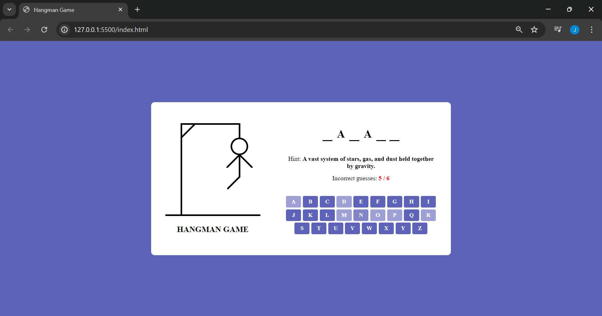

# Hangman Game  

A responsive **Hangman Game** built with **HTML, CSS, and JavaScript**.  
Guess the hidden word by selecting letters. Each wrong guess adds a part to the hangman — can you save them before it’s too late?  

## Features  
- Random word generator with hints  
- Responsive UI (works on desktop & mobile)  
- Virtual keyboard for easy letter selection  
- Progressive hangman illustration with wrong guesses  
- “Play Again” option to restart the game  

## Screenshots  

### Game Start

### Game Over

## Tech Stack  
- **HTML5** – structure  
- **CSS3** – styling & responsiveness  
- **JavaScript (ES6)** – game logic  

## Project Structure  
hangman-game/
├── index.html # Main HTML file
├── style.css # Stylesheet
├── scripts/
│ ├── script.js # Game logic
│ └── word-list.js # Word list with hints

## How to Play  
1. Start the game, a random word will be chosen.  
2. Use the on-screen keyboard to guess letters.  
3. For each wrong guess, a part of the hangman appears.  
4. Win by guessing all letters before the hangman is fully drawn.  

## Summary
Hangman Game built with HTML, CSS, and JavaScript. Players must guess the hidden word by selecting letters. Each incorrect guess adds a part to the hangman — with only 6 chances before the game is over. Includes random words, hints, virtual keyboard, and a responsive design

## Connect with Me
- 
- 
- 
